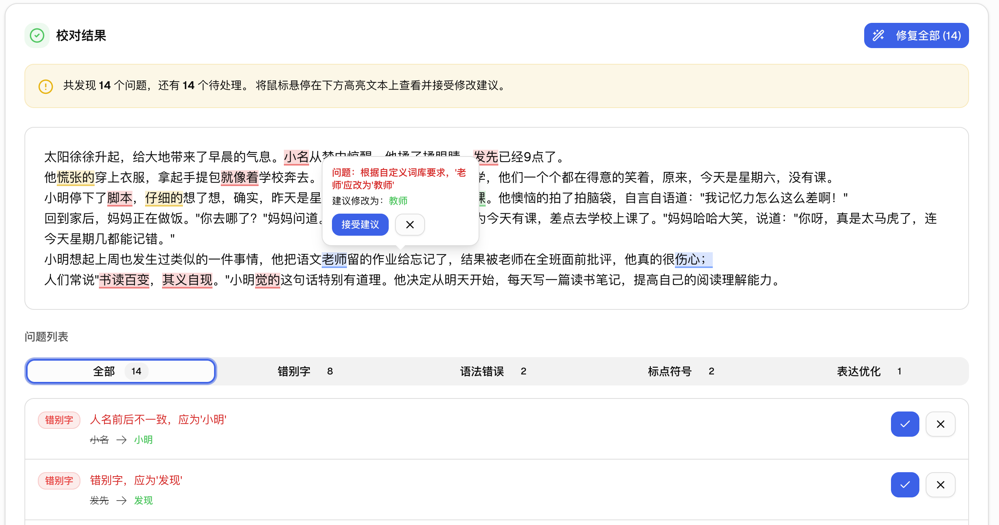
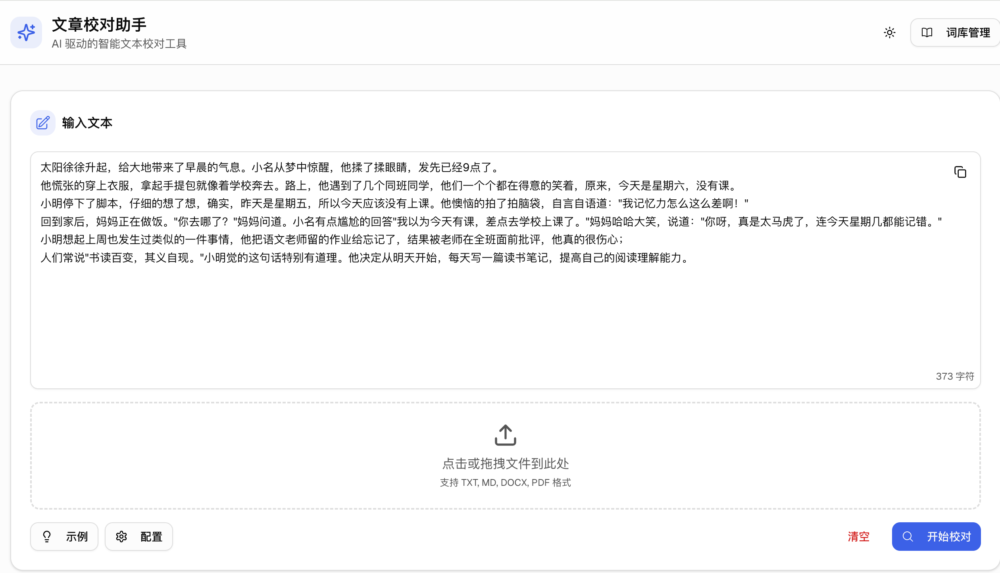
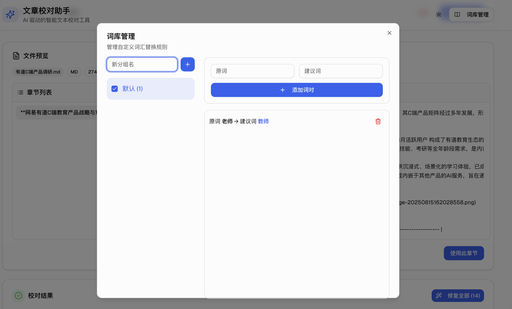

# Holdfire - 文章校对助手

一个基于 AI 的文章校对助手，可以自动检测并修复文章中的语法错误、拼写错误、标点符号问题和表达优化建议。



<details>
<summary>编辑器</summary>

</details>

<details>
<summary>自定义词库</summary>

</details>

## ✨ 主要功能

- **文章校对** - 检测并修复文章中的语法错误、拼写错误、标点符号问题和表达优化建议。
- **文件上传** - 支持txt,md,docx,pdf文件上传。
- **链接识别([firecrawl](https://firecrawl.dev))** - 识别文章链接，如公众号、知乎、头条等（在编辑器中粘贴链接）。
- **自定义词库** - 自定义词库，分组管理。
- **全局配置(api,提示词,强度)** - 全局配置，在线更新。
- **历史记录** - 保存历史记录。
- **本地存储** - 持久化存储。

## 🚀 技术栈

- **前端框架**: [Next.js](https://nextjs.org/) (React)
- **UI 组件库**: [shadcn/ui](https://ui.shadcn.com/)
- **样式**: [Tailwind CSS](https://tailwindcss.com/)
- **状态管理**: React Hooks + Context API
- **客户端打包**: [Electron](https://www.electronjs.org/)
- **语言**: [TypeScript](https://www.typescriptlang.org/)

## 🛠️ 快速开始

请按照以下步骤在本地运行此项目。

```bash
# 安装依赖
npm install

# 运行开发服务器
npm run dev

# 打包客户端
npm run electron:build
```

## 📝 配置环境变量

在项目根目录下创建一个名为 `.env.local` 的文件，并填入您配置信息。

```plaintext
# 快速配置 cp .env.template .env.local
NEXT_PUBLIC_OPENAI_API_URL=https://api.example.com/v1/chat/completions
NEXT_PUBLIC_OPENAI_API_KEY=your_api_key
NEXT_PUBLIC_OPENAI_MODEL=gpt-3.5-turbo
```

## 📂 项目结构

```
.
├── app/                # Next.js App Router, 包含页面和 API 路由
├── components/         # 可复用的 React 组件
├── electron/           # Electron 客户端
│   ├── main/           # Electron 主进程
│   └── preload/        # Electron 预加载脚本
├── hooks/              # React Hooks
├── lib/                # 核心工具函数和类
├── public/             # 静态资源
├── ...
```

## 🤝 贡献

欢迎任何形式的贡献！如果您有任何建议或发现任何问题，请随时提交 Pull Request 或创建 Issue。

